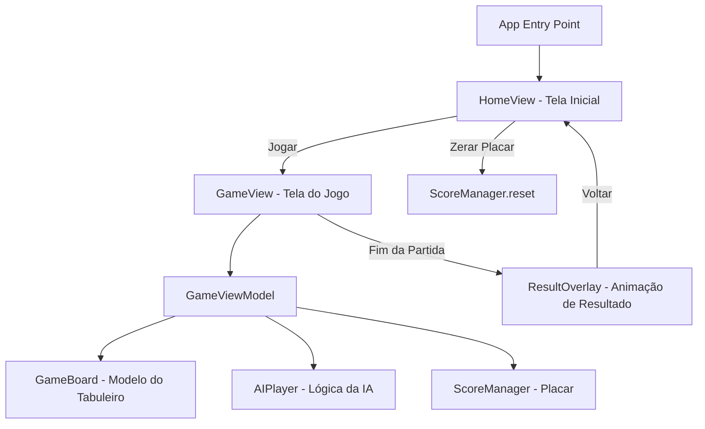

# Documento de Design — Jogo da Velha (Tic-Tac-Toe)

## Visão Geral

Este documento descreve o design técnico do jogo da velha para iOS, construído com Swift e SwiftUI. O aplicativo é single-player: o jogador humano ("X") compete contra uma IA ("O"). O sistema inclui tela inicial com placar persistente, tabuleiro 3x3 interativo, lógica de IA com estratégia de prioridade, detecção de vitória/empate, animações de resultado e persistência de placar via `UserDefaults`.

A arquitetura segue o padrão MVVM (Model-View-ViewModel), aproveitando os recursos nativos do SwiftUI como `@Published`, `@StateObject` e `@AppStorage` para reatividade e persistência.

## Arquitetura



### Camadas

1. **Views (SwiftUI)**: `HomeView`, `GameView`, `ResultOverlay`, `CellView`
2. **ViewModel**: `GameViewModel` — orquestra o fluxo do jogo, turnos e estado
3. **Models**: `GameBoard`, `Player`, `GameResult`, `Score`
4. **Services**: `AIPlayer` (lógica de IA), `ScoreManager` (persistência de placar)

## Componentes e Interfaces

### Views

#### HomeView
- Exibe botões "Jogar" e "Zerar Placar"
- Exibe o placar atual (vitórias, derrotas, empates)
- Navega para `GameView` ao pressionar "Jogar"
- Chama `ScoreManager.reset()` ao pressionar "Zerar Placar"

#### GameView
- Renderiza o tabuleiro 3x3 usando `LazyVGrid`
- Exibe o placar durante a partida
- Delega toques nas células ao `GameViewModel`
- Apresenta `ResultOverlay` quando a partida termina

#### CellView
- Renderiza uma célula individual do tabuleiro
- Exibe "X", "O" ou vazio conforme o estado

#### ResultOverlay
- Exibe texto animado: "You Win", "You Lose" ou "Draw"
- Botão para retornar à `HomeView`

### ViewModel

#### GameViewModel
```swift
class GameViewModel: ObservableObject {
    @Published var board: GameBoard
    @Published var isPlayerTurn: Bool
    @Published var gameResult: GameResult?
    
    func playerMove(at index: Int)   // Processa jogada do jogador
    func aiMove()                     // Executa jogada da IA
    func resetGame()                  // Reinicia o tabuleiro
}
```

### Services

#### AIPlayer
```swift
struct AIPlayer {
    static func bestMove(board: GameBoard) -> Int  // Retorna índice da melhor jogada
}
```

Estratégia de prioridade:
1. Vencer: se há uma jogada que completa 3 em linha para a IA, escolhê-la
2. Bloquear: se o jogador está prestes a vencer, bloquear
3. Posição estratégica: centro > cantos > laterais

#### ScoreManager
```swift
class ScoreManager: ObservableObject {
    @AppStorage("wins") var wins: Int
    @AppStorage("losses") var losses: Int
    @AppStorage("draws") var draws: Int
    
    func recordWin()
    func recordLoss()
    func recordDraw()
    func reset()
}
```

## Modelos de Dados

### Player
```swift
enum Player: String {
    case x = "X"  // Jogador humano
    case o = "O"  // IA
}
```

### GameBoard
```swift
struct GameBoard {
    var cells: [Player?]  // Array de 9 posições (nil = vazia)
    
    func isEmptyAt(_ index: Int) -> Bool
    func availableMoves() -> [Int]
    mutating func place(_ player: Player, at index: Int)
    func checkWinner() -> Player?
    func isDraw() -> Bool
}
```

Representação do tabuleiro como array linear de 9 posições:
```
[0][1][2]
[3][4][5]
[6][7][8]
```

Combinações vencedoras (constante):
```swift
let winPatterns: [[Int]] = [
    [0,1,2], [3,4,5], [6,7,8],  // linhas
    [0,3,6], [1,4,7], [2,5,8],  // colunas
    [0,4,8], [2,4,6]             // diagonais
]
```

### GameResult
```swift
enum GameResult {
    case win    // Jogador venceu
    case lose   // IA venceu
    case draw   // Empate
}
```

### Score
Persistido via `@AppStorage` no `ScoreManager`. Três contadores inteiros: `wins`, `losses`, `draws`.


## Propriedades de Corretude

*Uma propriedade é uma característica ou comportamento que deve ser verdadeiro em todas as execuções válidas de um sistema — essencialmente, uma declaração formal sobre o que o sistema deve fazer. Propriedades servem como ponte entre especificações legíveis por humanos e garantias de corretude verificáveis por máquina.*

### Propriedade 1: Reset do placar zera todos os contadores

*Para qualquer* estado de placar (wins, losses, draws com valores arbitrários não-negativos), chamar `reset()` deve resultar em wins = 0, losses = 0 e draws = 0.

**Valida: Requisito 1.4**

### Propriedade 2: Jogada do jogador marca "X" em célula vazia

*Para qualquer* tabuleiro com pelo menos uma célula vazia e qualquer índice de célula vazia, executar `playerMove(at: index)` durante o turno do jogador deve resultar em `board.cells[index] == .x`.

**Valida: Requisito 3.1**

### Propriedade 3: Toque em célula ocupada não altera o tabuleiro

*Para qualquer* tabuleiro e qualquer índice de célula já ocupada, executar `playerMove(at: index)` deve manter o tabuleiro inalterado (o array `cells` antes e depois deve ser idêntico).

**Valida: Requisito 3.2**

### Propriedade 4: Input do jogador é ignorado durante o turno da IA

*Para qualquer* tabuleiro onde `isPlayerTurn == false`, executar `playerMove(at: index)` para qualquer índice (vazio ou ocupado) deve manter o tabuleiro inalterado.

**Valida: Requisito 3.3**

### Propriedade 5: IA sempre joga em uma célula vazia válida

*Para qualquer* tabuleiro não-terminal com pelo menos uma célula vazia, `AIPlayer.bestMove(board:)` deve retornar um índice onde `board.cells[index] == nil`.

**Valida: Requisito 4.1**

### Propriedade 6: IA prioriza vitória sobre bloqueio e bloqueio sobre posição estratégica

*Para qualquer* tabuleiro onde a IA pode vencer em uma jogada, `AIPlayer.bestMove(board:)` deve retornar o índice que completa a vitória. *Para qualquer* tabuleiro onde a IA não pode vencer mas o jogador pode vencer na próxima jogada, `AIPlayer.bestMove(board:)` deve retornar o índice que bloqueia a vitória do jogador.

**Valida: Requisito 4.2**

### Propriedade 7: Detecção correta de vencedor

*Para qualquer* tabuleiro onde um jogador possui três símbolos iguais em uma linha, coluna ou diagonal, `checkWinner()` deve retornar esse jogador. *Para qualquer* tabuleiro onde nenhum jogador possui três em linha, `checkWinner()` deve retornar `nil`.

**Valida: Requisito 5.1**

### Propriedade 8: Detecção correta de empate

*Para qualquer* tabuleiro completamente preenchido (9 células ocupadas) onde `checkWinner()` retorna `nil`, `isDraw()` deve retornar `true`. *Para qualquer* tabuleiro com pelo menos uma célula vazia, `isDraw()` deve retornar `false`.

**Valida: Requisito 5.2**

### Propriedade 9: Registro de resultado incrementa apenas o contador correto

*Para qualquer* estado de placar e qualquer resultado (win, loss ou draw), registrar esse resultado deve incrementar apenas o contador correspondente em 1, mantendo os outros dois contadores inalterados.

**Valida: Requisitos 7.1, 7.2, 7.3**

### Propriedade 10: Persistência do placar (round trip)

*Para qualquer* placar com valores arbitrários não-negativos, salvar o placar e depois lê-lo do armazenamento local deve produzir os mesmos valores de wins, losses e draws.

**Valida: Requisito 7.4**

### Propriedade 11: Nova partida começa com o turno do jogador

*Para qualquer* inicialização de jogo (chamada a `resetGame()` ou criação de novo `GameViewModel`), `isPlayerTurn` deve ser `true` e o tabuleiro deve estar completamente vazio (todas as 9 células `nil`).

**Valida: Requisito 8.1**

### Propriedade 12: Turnos alternam após cada jogada válida

*Para qualquer* sequência de jogadas válidas em um jogo, o valor de `isPlayerTurn` deve alternar após cada jogada — `true` após jogada da IA, `false` após jogada do jogador.

**Valida: Requisito 8.2**

## Tratamento de Erros

| Cenário | Comportamento |
|---------|--------------|
| Toque em célula ocupada | Ignorar silenciosamente, sem feedback de erro |
| Toque durante turno da IA | Ignorar silenciosamente |
| Índice de célula fora do range (0-8) | Guard clause, sem efeito |
| Falha na leitura do `UserDefaults` | Usar valores padrão (0, 0, 0) |
| Jogada da IA sem células disponíveis | Não deve ocorrer (jogo termina antes), mas guard clause como proteção |

## Estratégia de Testes

### Abordagem Dual

O projeto utiliza testes unitários e testes baseados em propriedades de forma complementar:

- **Testes unitários**: verificam exemplos específicos, edge cases e condições de erro
- **Testes de propriedade**: verificam propriedades universais em inputs gerados aleatoriamente

### Biblioteca de Testes de Propriedade

Utilizar **SwiftCheck** (ou `swift-testing` com geração customizada) como biblioteca de property-based testing para Swift.

### Configuração dos Testes de Propriedade

- Mínimo de **100 iterações** por teste de propriedade
- Cada teste deve referenciar a propriedade do design com um comentário no formato:
  - `// Feature: tic-tac-toe-game, Property {número}: {título}`

### Testes Unitários

- Verificar que `HomeView` exibe botões "Jogar" e "Zerar Placar" (Requisito 1.1)
- Verificar que `HomeView` exibe o placar atual (Requisito 1.2)
- Verificar navegação para `GameView` com tabuleiro vazio (Requisito 1.3)
- Verificar que `GameView` renderiza grade 3x3 com 9 células (Requisito 2.1)
- Verificar que o placar é exibido durante a partida (Requisito 2.2)
- Verificar texto "You Win" para vitória do jogador (Requisito 6.1)
- Verificar texto "You Lose" para vitória da IA (Requisito 6.2)
- Verificar texto "Draw" para empate (Requisito 6.3)
- Verificar botão de retorno na tela de resultado (Requisito 6.4)

### Testes de Propriedade

Cada propriedade de corretude (1-12) deve ser implementada como um **único** teste de propriedade:

- **Feature: tic-tac-toe-game, Property 1: Reset do placar zera todos os contadores**
- **Feature: tic-tac-toe-game, Property 2: Jogada do jogador marca "X" em célula vazia**
- **Feature: tic-tac-toe-game, Property 3: Toque em célula ocupada não altera o tabuleiro**
- **Feature: tic-tac-toe-game, Property 4: Input do jogador é ignorado durante o turno da IA**
- **Feature: tic-tac-toe-game, Property 5: IA sempre joga em uma célula vazia válida**
- **Feature: tic-tac-toe-game, Property 6: IA prioriza vitória sobre bloqueio e bloqueio sobre posição estratégica**
- **Feature: tic-tac-toe-game, Property 7: Detecção correta de vencedor**
- **Feature: tic-tac-toe-game, Property 8: Detecção correta de empate**
- **Feature: tic-tac-toe-game, Property 9: Registro de resultado incrementa apenas o contador correto**
- **Feature: tic-tac-toe-game, Property 10: Persistência do placar (round trip)**
- **Feature: tic-tac-toe-game, Property 11: Nova partida começa com o turno do jogador**
- **Feature: tic-tac-toe-game, Property 12: Turnos alternam após cada jogada válida**
